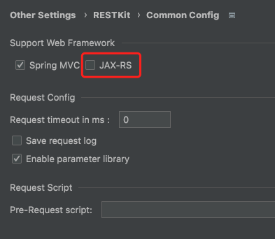

# RESTKit-JAX-RS

[简体中文](./README.zh_CN.md)

[RESTKit-JAX-RS](https://plugins.jetbrains.com/plugin/17955-restkit-jax-rs) is a plugin that support JAX-RS apis scanning for [RESTKit](https://plugins.jetbrains.com/plugin/14723-restkit) plugin from version 2.0.0.

> Note  
> RESTKit plugin has provided extension point from version 2.0.0. You can also support your web framework restful apis like this plugin.

If this plugin helps, please **🌟Star**! If you have any good idea, please let me know.

## Install
- **Using IDE plugin system**

Recommended <kbd>Preferences(Settings)</kbd> > <kbd>Plugins</kbd> > <kbd>Browse repositories...</kbd> > <kbd>find "RESTKit-JAX-RS"</kbd> > <kbd>Install Plugin</kbd>

- **Local Install**

Download plugin form <kbd>distributions/RESTKit-JAX-RS-x.x.x.zip</kbd>, then <kbd>Preferences(Settings)</kbd> > <kbd>Plugins</kbd> > <kbd>Install Plugin from Disk...</kbd>

## Usage
After installed this plugin, you should enable it in `RESTKit` setting. Refresh in `RESTKit` window.

