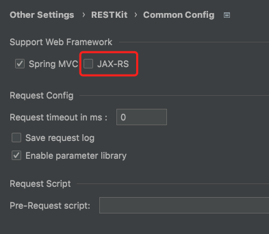

# RESTKit-JAX-RS

[RESTKit-JAX-RS](https://plugins.jetbrains.com/plugin/17955-restkit-jax-rs) 是一个依赖于[RESTKit](https://plugins.jetbrains.com/plugin/14723-restkit) 插件的插件，用于为`RESTKit`(2.0.0开始) 提供JAX-RS apis扫描。

> 注意  
> RESTKit从2.0.0开始提供了扩展点，如同本插件，你也能为RESTKit提供自己所需的接口扫描方式。

如果你觉得本插件不错，请给个🌟Star吧，同时也欢迎提供宝贵的建议。

## 安装
- **插件市场安装**

推荐 <kbd>Preferences(Settings)</kbd> > <kbd>Plugins</kbd> > <kbd>Browse repositories...</kbd> > <kbd>输入"RESTKit-JAX-RS"</kbd> > <kbd>点击Install</kbd>

- **本地安装**

从仓库下载<kbd>distributions/RESTKit-JAX-RS-x.x.x.zip</kbd>, 然后在本地Idea安装 <kbd>Preferences(Settings)</kbd> > <kbd>Plugins</kbd> > <kbd>Install Plugin from Disk...</kbd>

## 使用
安装完成后，在`RESTKit`插件设置中启用，然后在`RESTKit`窗口刷新项目接口。

